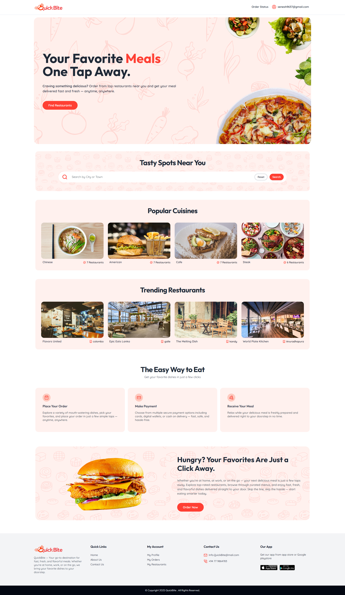

# 🍔 Quickbite Food Ordering App (MERN + TypeScript)

A modern full-stack web application for ordering food online, built with React, Express, TypeScript, MongoDB, and Tailwind CSS. Users can browse a variety of Restaurant and their menus, add them to the cart, place orders, and track order status in real-time.

---

## 🧰 Tech Stack

### 🖥 Frontend
- ⚛️ React + TypeScript
- 🎨 Tailwind CSS
- 🌐 React Router DOM
- 🔗 Axios
- ✨ Shadcn UI
- ⚛️ React Query & React Hook Form

### 🖥 Backend
- 🟩 Node.js
- 🚀 Express.js
- ✍️ TypeScript
- 🔐 Auth0 (JWT-based authentication)
- 📂 RESTful APIs

### 🛢 Database
- 🧾 MongoDB (via Mongoose)

---

## 📦 Features

### 👨‍🍳 Customer-Facing
- Search restaurants by city
- Filter restaurants by cuisine
- Browse menus and add items to cart
- Place orders and receive order confirmations
- Real-time order status tracking
- Mobile-first responsive design
- Stripe payment integration with webhook support
- User accounts to view order history and status


### 🔒 Authentication

- Secure Auth0 authentication with JWT
- Protected routes using token validation

---

## 🖼 Screenshots



---

📂 Project Structure
mern-food-order-app/
├── client/             # Frontend (React + Tailwind + TypeScript)
├── server/             # Backend (Express + TypeScript)
├── screenshots/        # Screenshots for documentation
└── README.md


## 🛠 Setup Instructions

### 1. Clone the Repository

```bash
git clone https://github.com/SeneshAnujaya/mern-food-order-app.git

🚀 Live Demo

Live URL : https://quickbite-frontend-psi.vercel.app/

📝 License
MIT License
© 2025 Senesh Anujaya

